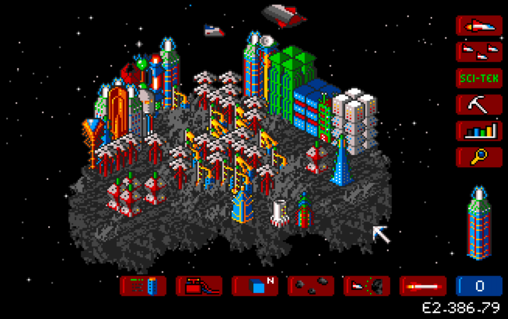

I am a big fan of the game K240 which I played a lot with my step brother back in the 90ies on an Amiga Commodore 500. There is a standalone application for macOS provided by "Games Nostalgia" which bundles the game and the Amiga emulator FS-UAE and works out of the box.

Unfortunately, on my new M1 MacBook it did not start up correctly, instead I got a very generic "Killed: 9" error:

    /Applications/K240.app/Contents/Resources/script: line 25: 13832 Killed: 9               ./MacOS/fs-uae ./Resources/Default.fs-uae 1 > /dev/null

I opened the Console.app to check for more logs and under Crash Reports I found the cause of the error: invalide code signature.

Here is the relevant part of the log:

    Hardware Model:      MacBookAir10,1
    Process:             fs-uae [13832]
    Path:                /Applications/K240.app/Contents/MacOS/fs-uae
    Identifier:          fs-uae
    Version:             ???
    Code Type:           X86-64 (Native)
    Role:                Unspecified
    Parent Process:      Exited process [13823]
    Coalition:           org.gamesnostalgia.amiga.K240 [161896]
    Responsible Process: K240 [13803]

    Date/Time:           2024-10-08 10:54:28.2874 +0200
    Launch Time:         2024-10-08 10:54:28.2275 +0200
    OS Version:          macOS 15.0 (24A335)
    Release Type:        User
    Report Version:      104

    Exception Type:  EXC_CRASH (SIGKILL (Code Signature Invalid))
    Exception Codes: 0x0000000000000000, 0x0000000000000000
    Termination Reason: CODESIGNING 1 Taskgated Invalid Signature

The fix is as easy as resigning the application in the terminal:

    /Applications/K240.app/Contents
    ❯ codesign --force --sign - MacOS/fs-uae
    MacOS/fs-uae: replacing existing signature

Have fun ;)
